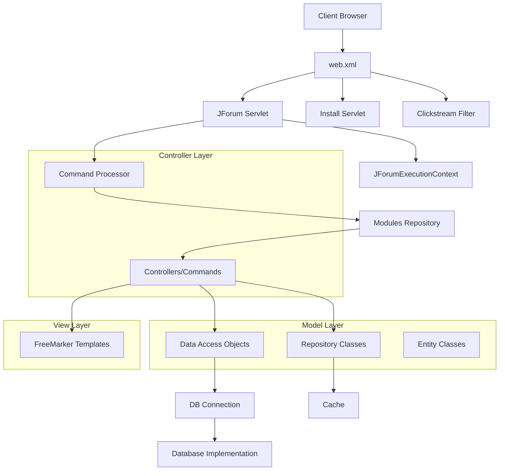

# Architecture Analysis Report

## Summary
JForum2 is a Java-based forum application that follows a classic MVC (Model-View-Controller) architecture pattern. It's built as a Java web application with a servlet-based front controller pattern. The application uses a custom command pattern implementation for handling requests, a DAO (Data Access Object) pattern for database operations, and FreeMarker templates for the view layer. The architecture is designed to be database-agnostic through abstraction layers and supports multiple database implementations.

## Entry Points
- `/src/net/jforum/JForum.java` → Main servlet entry point (*.page URLs)
- `/src/net/jforum/InstallServlet.java` → Installation servlet (/install/install.page)
- `/WEB-INF/web.xml` → Servlet mappings and filter configurations

## Architectural Style
JForum2 implements a classic MVC (Model-View-Controller) architecture with the following characteristics:

1. **Front Controller Pattern**: The `JForum.java` servlet acts as the front controller, receiving all requests and delegating them to appropriate command handlers.

2. **Command Pattern**: Each module is implemented as a Command class that extends the abstract `Command.java` class, which processes requests and prepares responses.

3. **DAO Pattern**: Data access is abstracted through interfaces in the `dao` package with multiple implementations for different database systems.

4. **Repository Pattern**: The application uses repository classes to cache and manage entities.

5. **Template View Pattern**: FreeMarker templates are used for the view layer, separating presentation from business logic.

6. **Singleton Pattern**: Used for configuration and database connection management.

## UI/Backend Violations
- `templates/default/*.htm` files contain FreeMarker template syntax that mixes presentation with some business logic decisions (conditionals, loops)
- Template files contain direct references to data models and sometimes complex logic for rendering
- Example: `/templates/default/forum_show.htm:204-218` contains complex conditional logic for rendering topic listings

## Architecture Diagram


## Component Details

### Front Controller
The `JForum.java` servlet acts as the front controller, handling all incoming requests with the `.page` extension. It initializes the execution context, processes security, and delegates to the appropriate command handler.

```java
// From JForum.java
public void service(HttpServletRequest req, HttpServletResponse res) throws IOException, ServletException {
    // ...
    String module = request.getModule();
    String moduleClass = module != null ? ModulesRepository.getModuleClass(module) : null;
    // ...
    Command c = this.retrieveCommand(moduleClass);
    Template template = c.process(request, response, context);
    // ...
}
```

### Command Pattern
The `Command.java` abstract class defines the interface for all controller actions. Each module extends this class and implements specific actions as methods:

```java
// From Command.java
public Template process(RequestContext request, ResponseContext response, SimpleHash context) {
    // ...
    String action = this.request.getAction();
    if (!this.ignoreAction) {
        try {
            this.getClass().getMethod(action, NO_ARGS_CLASS).invoke(this, NO_ARGS_OBJECT);
        }
        catch (NoSuchMethodException e) {        
            this.list();        
        }
    }
    // ...
}
```

### Data Access Layer
The `DataAccessDriver.java` abstract class provides a factory for creating DAO instances. This pattern allows for database-agnostic code:

```java
// From DataAccessDriver.java
public static DataAccessDriver getInstance() {
    return driver;
}

public abstract ForumDAO newForumDAO();
public abstract UserDAO newUserDAO();
// ...
```

### View Layer
FreeMarker templates are used for the view layer. Templates are loaded based on the action and module:

```java
// From Command.java
return JForumExecutionContext.templateConfig().getTemplate(
    new StringBuffer(SystemGlobals.getValue(ConfigKeys.TEMPLATE_DIR)).
    append('/').append(this.templateName).toString());
```

### URL Routing
URL routing is handled through the `modulesMapping.properties` file, which maps URL modules to controller classes:

```properties
# From modulesMapping.properties
forums = net.jforum.view.forum.ForumAction
posts = net.jforum.view.forum.PostAction
user = net.jforum.view.forum.UserAction
```

## Key Architectural Decisions

1. **Database Abstraction**: The application uses a DAO pattern with multiple implementations to support different database systems (MySQL, PostgreSQL, Oracle, etc.).

2. **Template System**: FreeMarker templates are used for the view layer, allowing for theme customization without changing Java code.

3. **Plugin Architecture**: The application supports extensions through a modular design.

4. **Caching**: Repository classes cache frequently accessed data to improve performance.

5. **Security Model**: A permission-based security model is implemented with group-based access control.

## Strengths and Weaknesses

### Strengths
- Clear separation of concerns through MVC pattern
- Database-agnostic design through DAO abstraction
- Modular architecture allowing for extensions
- Caching mechanism for improved performance

### Weaknesses
- Some business logic leaks into the view templates
- Heavy use of singletons and static methods makes testing difficult
- Tight coupling between some components
- Legacy servlet-based architecture instead of more modern frameworks

## Conclusion
JForum2 follows a classic MVC architecture with clear separation of concerns. The application uses several design patterns to achieve modularity and extensibility. The main architectural challenge is the mixing of business logic in templates and the legacy servlet-based approach, which could be modernized to use more contemporary Java web frameworks.